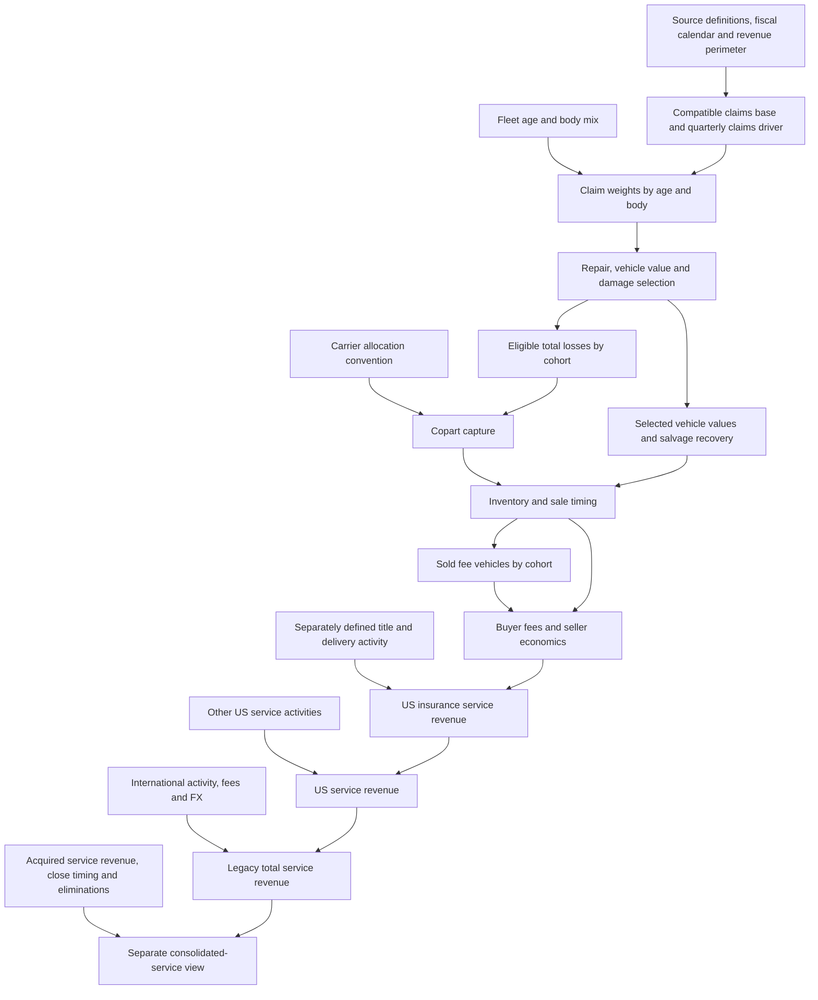

# Architecture completion audit

**Implementation follow-through:** [integrated model](../model/integrated_service_2026-09-28/README.md) now closes Stages A–D for a provisional legacy-service model, with explicit assumptions and sale-equivalent timing. See its [component closure ledger](../model/integrated_service_2026-09-28/COMPLETION_STATUS.md). The audit below records the pre-integration findings. Acquisition classification and predictive validation remain unresolved; historical errors are visible.

28 September 2026. Governing priority: complete a coherent quarterly service-revenue model before testing thesis deltas, consensus gaps or stock-price implications. This audit is read-only inspection of existing research, prototype formulas and source inventories. No new model scenario, backtest, materiality screen or forecast was run. Excel design remains with Fable.

## Executive finding

We have a linked quarterly prototype and several newer standalone research components, not one completed current model. Some missing work is evidence, some is implementation, and some is inconsistent definitions between components. More repair calibration alone does not complete the architecture.

Correction to the earlier chat summary: inventory, title, delivery, other-US and international equations already exist in `model/linked_service_revenue_2026-09-28/build.mjs`. Their inputs/conventions are provisional. They must not be described as entirely unbuilt. Conversely, newly completed repair/value research is not integrated into that prototype. A documented recommendation is not an implemented change.

## Scope and model completion standard

Primary output: quarterly legacy Copart US service revenue, international service revenue and total service revenue, with historical controls. Purchased-vehicle sales are excluded from this output but their units must be segregated from fee units. Maintain a separate acquisition contribution for any consolidated-service view; do not label legacy-only output consolidated post-acquisition revenue. ACV Auctions and vehicle actual cash value are distinct concepts.

No EPS, CapEx, DCF or price target work in this completion phase. Existing acquisition timing research is a separate perimeter module, not a reason to reopen valuation. Consensus comparisons and thesis attributions are deferred.

“Complete” means every dollar branch is assigned once, each necessary input is reported/derived/proxy/assumed/missing, each interface has a defined population and time basis, all branches are executable together, and accounting checks reconcile. It does NOT require every input to be empirically identified. Historical reconstruction errors remain visible; a completed model can still fail predictive validation. Do not hide errors to declare completion.

## Intended flow and ownership

Reported RPU is an output using its compatible disclosed denominator. Core auction fees and service-specific activity must not all be forced onto the same unit denominator. Selected economics follow the originating cohort through any inventory lag. Carrier allocation is applied once, using total-loss weights rather than a second independent market-share multiplier.

## Component ledger

Implementation and evidence are separate statuses. “Runnable” below does not mean validated.

| ID / component | Existing implementation and evidence | Gap / completion action |
|---|---|---|
| 01 Periods and financial controls | Eight fiscal quarters in linked inputs. Filing-derived US/international service dollars; separate historical bridge. | Consolidate into one control table with exact fiscal dates, units, ownership basis and source status. Keep calendar CCC observations distinct from fiscal sales. |
| 02 Revenue perimeter and base scale | Prototype assumes 90% of FY26Q4 US service dollars are insurance, then infers absolute claim/unit scale from modeled RPU. | Resolve or explicitly retain the insurance-dollar share as an assumption. One dollar anchor cannot independently identify units, fees and service mix. Record what is normalized versus observed. |
| 03 Fleet roll | Runnable 184 age/body stock rows, 24 economic cohorts. Birth/survival history exists. | Constant light-truck subtype mix across vintages and fitted claim-age weights remain proxies. Separate changing population totals from normalized cohort composition so fleet growth is not counted again in claims exposure. |
| 04 Covered exposure and claims | Prototype multiplies relative fleet claims by a calibrated scale, frequency factor and coverage/filing factor. Drivers default to one. Carrier and CCC research exists. | No matched independent industry exposure × frequency series is integrated. Choose ONE driver convention: compatible reported claims or covered exposure × reported frequency. Separate filing model is unnecessary unless independently supported. Retire duplicate coverage/filing multiplier when already embedded. |
| 05 Claim mix by carrier/age/body | Friend carrier weights plus common cohort economics; carrier claim factors neutral. | Specify how carrier weights join cohort claims. Common age/body profile is an acceptable declared first version. Do not imply observed carrier-specific damage mix. Premium shares remain proxies. |
| 06 Damage/repair/value selection | New runnable age-constrained engine matches six TLFs, four selected values and two repaired means. | New component is not wired into quarterly prototype, which still uses old values, one dispersion and nine states. Integrate the six new cohort parameters and preserve coverage/period caveats. Freeze calibration parameters across quarters; do not recalibrate to revenue. |
| 07 Coverage and catastrophes | Prototype has a zero-default additional CAT claim fraction; research distinguishes comp/noncomp. | Existing single-pool adjustment is not a dedicated CAT build. Choose a labeled combined-population first version or separate mutually exclusive streams. Never compare ex-CAT units with unmatched all-loss claims as if identical. No separate CAT engine required merely for complexity. |
| 08 Auction eligibility/routing | Explicit routing multiplier, currently 100%. | Keep as an assumption or embedded effective-capture convention until owner retention/other routes are sourced. Clarify friend's allocation denominator before applying routing separately. |
| 09 Copart allocation | Full friend path integrated in prototype. Separate carrier note proposes PGR-only runoff with fixed other allocations/weights. | Proposed simplification not integrated. Implement the documented simplified convention, preserving original as reference. It is a sale-equivalent scenario, not verified assignment share. Do not apply another PGR haircut. |
| 10 Assignments/inventory/sales | Runnable opening + assignments − sales = ending inventory. Opens at zero; 100% same-quarter conversion. | Neutral timing bypass, not a measured inventory build. For initial integration retain sale-equivalent capture and explicitly bypass lag. Activate physical assignments/inventory only with opening balances, non-sale exits and cohort timing; then revise capture convention to prevent double lag. |
| 11 Selected auction values | Joint damage states link vehicle value to recovery. Revised component supports coherent selected values. | Gross recovery function is assumed, not independently measured. Carry the same selected states to sold-unit fee calculations; never substitute unselected average vehicle value. No bulk auction scrape needed for integration. |
| 12 Buyer fees | Posted schedules parsed; standard/preferred secured-payment, non-clean-title calculation runnable. | Schedule/buyer mix assumed; current schedules are not historical schedules. Preserve supported subpopulation and fixed-fee definitions. Updated damage engine's numerical integration is standalone. |
| 13 Seller economics | Prototype has carrier seller-rate inputs, all initialized to 4%; simplified totaling net recovery assumes 4%. | No contracts verify rates. Keep one explicit provisional convention, distinguish buyer fees from seller net proceeds, and document omitted towing/handling/other net costs. Do not add a contract-concession thesis. |
| 14 Title services | Prototype uses 50% use × $50 per sold vehicle; management adoption evidence exists. | These are illustrative. Need eligible activity/base revenue and pricing/recognition/bundling convention. For first complete model retain explicit provisional levels or a labeled combined ancillary schedule; do not call residual dollars measured title revenue. |
| 15 Delivery | Prototype uses 10% use × $300; separate cost-based scenarios and source audit exist. | No measured revenue/job/adoption base. Research is parked. Carry transparent assumptions; do not infer revenue from cost as fact. Account for fee waivers and possible overlap with noninsurance. No renewed collection in completion phase. |
| 16 Other US service revenue | Activity-equivalent count × $500 with flat factors, anchored to 10% residual of US base revenue. | Not measured units. Define included noninsurance consignment, registration/referral/other activity and exclusions. Use explicit quarterly activity/fee assumptions; exclude dollars already allocated to services above. |
| 17 International services | Activity-equivalent count × $750 × FX; flat FY26Q4 base. | Coarse placeholder, not developed unit build. Use compatible prior-year quarterly controls and declared unit/fee/FX conventions. Flat sequential Q4 repetition is not “zero growth.” Separate purchase-to-consignment effects. |
| 18 Acquisition overlay | Standalone timing and fiscal-mapping work; management aggregate projections. | Not integrated; acquired service classification, close convention and eliminations unresolved. Keep separate from legacy completion. Until classified, an acquired-total-revenue projection cannot be relabeled acquired service revenue. |
| 19 Historical reconciliation | Historical accounting bridge works; earlier prototype has quarter-specific misses. | Accounting attribution does not validate operating engine. Assemble a residual report after integration; do not fill residuals by changing historical cohort economics or by inventing noninsurance revenue. |
| 20 Summary/consensus | Four reading views approved; prototype dollar summary runnable. CapIQ/analyst scope research exists. | Update summary only after branches connect. Consensus/delta/valuation are consumers of the completed output, not drivers or completion targets. |

## Exact integration breaks found

1. `build.mjs` still sets $10,000 age-ten car value, .10 cross-age slope and shared dispersion. `age_constrained_engine_results.json` contains a different six-cohort parameter set and two dispersions. No connector currently replaces the old Damage Engine.
2. The new component's historical claim weights are calibrated to CCC valuation mix; the prototype uses fleet-derived claim weights. These are different quantities. Do not overwrite evolving fleet weights with static calibration weights. Normalize forecast fleet composition to the declared historical base, preserving historical weights as the calibration reference, with the transfer labeled an assumption.
3. The friend full carrier build remains in `inputs.json`. The simplified PGR-only recommendation remains in documentation. A single input adapter must select one convention.
4. The prototype labels capture output assignments yet uses a potentially sale-based allocation path. Neutral conversion avoids adding delay but is not a physical assignment forecast. Rename the bypass output sale-equivalent captured vehicles until the inventory path is activated.
5. Prototype title/delivery inputs imply a $55 per-sale ancillary addition. That assumed addition also influences inferred absolute unit scale. Changing ancillary base requires one explicit historical normalization review, not an invisible unit rescaling every forecast quarter.
6. Other-US and international divisions by assumed activity fees create equivalent units; multiplying them back gives anchored revenue. This is transparent scale arithmetic, not independent bottom-up evidence. Avoid passing these equivalents into real auction-capacity or fleet calculations.
7. Noninsurance/insurance seller classification and purchased/consigned accounting classification remain separate. Service-only output cannot use all sold vehicles indiscriminately.

## Build sequence before any thesis-delta test

### Stage A — Lock definitions and starting balances

Deliver one period/perimeter/control table and assumption register. Define every revenue branch, fee-unit denominator and source status. Identify the base-dollar split and one declared normalization. Carry unavailable inputs as unavailable or explicit assumptions, not zero. Include legacy/acquisition scope labels. This uses existing controls first; no need for exhaustive data acquisition.

Completion gate: every historical reported service dollar belongs to a control total; every modeled branch has an exclusive perimeter; derived/assumed components are not described as disclosures. Historical model errors can remain visible rather than plugged.

### Stage B — Connect claims, cohort economics and allocation

Deliver one analytical runner outside Excel. Choose claims driver convention; connect fleet composition to claim weights; load the age-constrained economic parameters; apply routing/capture once. Integrate the documented carrier simplification. Use neutral sale-equivalent timing initially, explicitly named. Preserve source inputs and prior versions.

Completion gate: one named input snapshot produces quarterly claim weights, total-loss states, captured sale-equivalent vehicles and their selected price distributions. Calibration weights and forecast exposure weights are not silently interchanged. This is integration work, not a thesis scenario run.

### Stage C — Complete fee/services and remaining revenue branches

Connect sold states to buyer and seller fees. Specify title/delivery and non-unit-service denominators and recognition conventions. Use declared simple assumptions where evidence is absent; leave delivery research parked. Populate other-US and international quarterly drivers with historical seasonality/basis explicit. Establish a separate acquired-service inclusion gate if required by the chosen consolidated scope.

Completion gate: US insurance core fees + non-overlapping service activity + other US + international sums to legacy total service revenue. Acquired contribution and eliminations, if used, remain separately visible. No unexplained total-service-growth assumption, no double-counted ancillary dollars.

### Stage D — Structural QA and Fable handoff

Check period mapping, weight normalization, exclusive populations, inventory conservation if activated, fee schedule application, branch addition, missing-data propagation and source traceability. Compile historical residuals without forcing them away. Supply machine-readable parameters and results plus four-view mapping: RPM Summary, Volume Build, Vehicle Economics, Revenue Bridge. Source tables remain separate from calculation engines.

Completion gate: reproducible whole-model run, all necessary assumptions listed, no disconnected new research module, no blank forecast branch silently treated as zero, and documented limitations. Do not claim forecasting accuracy merely because accounting checks pass.

### Stage E — Only after model completion

Review historical predictive behavior, introduce evidence-supported quarterly driver changes, then perform thesis attribution and compare matched-scope consensus. Do not run those steps during this audit. User's order is model first, then whether assumptions produce meaningful delta.

## Minimum complexity and stopping rules

Needed now: coherent claims convention, explicit normalization, economic-engine integration, carrier convention, timing convention, non-overlapping service schedules and all revenue branches. Not needed now: exact insurer contracts, every repair part, carrier-specific cohort models without evidence, a fitted nationwide coverage elasticity, a large listing scrape, or a detailed foreign-country thesis.

Simple assumptions can make a complete provisional model; they must stay visible. A purely arbitrary activity × fee restatement should not be marketed as independently explaining revenue. If a missing source prevents identification, document the assumed parameter and its role; do not add a speculative side build to disguise it. Expensive acquisition/experiments still require a separate user-approved cost/method proposal.

## Evidence inspected for this audit

- `model/linked_service_revenue_2026-09-28/README.md`, `build.mjs`, `prepare.py` and earlier validator inspection: actual prototype formulas and defaults.
- `model/service_revenue_2026-09-27/APPROVED_ARCHITECTURE.md`: approved reading views and scope.
- `docs/us_units_architecture_2026-09-27/README.md`: claims/units definitions and historical evidence map.
- `docs/legacy_foundation_2026-09-28/README.md` and `HISTORICAL_BRIDGE.md`: actual versus inferred fee units and unresolved reconstruction.
- `docs/carrier_test_2026-09-28/README.md`: simplified allocation proposed but not integrated.
- `docs/rpu_service_build_2026-09-28/README.md`: service denominators, evidence and parked delivery work.
- `docs/acv_reconciliation_2026-09-28/README.md`: separate acquisition perimeter and timing research, not current-event reverification.
- `docs/fleet_selection_2026-09-28/AGE_CONSTRAINED_ENGINE.md` and outputs: latest repair/value component, standalone calibration limitations.

This audit supersedes earlier narrative statements about completion status, not the source records or user-approved presentation structure. No external research or fresh financial-fact verification was necessary to audit what is implemented locally.
