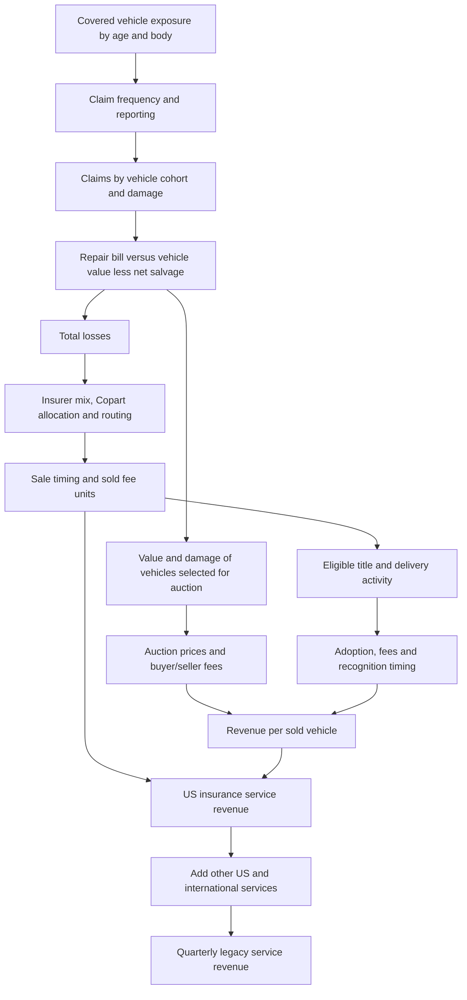

# Copart memo writer handoff: the balance between units and revenue per unit

**As of September 28, 2026.** This is the main-picture handoff for drafting the investment memo. It explains the argument, research hypotheses, model architecture and limits of the current evidence. It is not a completed short recommendation. Our horizon is approximately six months, with quarterly service-revenue performance as the immediate test. A long remains possible if the evidence supports it.

## The core argument

**Copart earns fees from the vehicles that reach its auctions. The forces that make each vehicle more valuable can also change how many vehicles reach the auction in the first place. Our question is whether the additional revenue per sold vehicle compensates for the change in sale volume—and whether that balance is better or worse than investors expect.**

We are studying two connected developments: changes in the vehicles moving through the insurance system, and changes in the services Copart sells around each vehicle. Fleet age, the shift toward crossovers and pickups, repair economics, insurer allocation and ancillary adoption affect different parts of this process. The differentiated work is to connect those mechanisms rather than forecast units and revenue per unit independently.

Here is a possible opening paragraph for a draft. It describes the research argument without claiming that the result has already been established:

> Copart's key debate is whether richer auctions can compensate for fewer vehicles. A vehicle that is worth more before an accident may produce a higher auction price if totaled, but that higher value can also make repairing it more economical, preventing it from reaching Copart at all. Meanwhile, additional services can raise revenue per vehicle without improving auction supply. We model the same vehicles through both the insurer's total-loss decision and Copart's fee schedule to determine which effect dominates. The investment opportunity is a divergence between the resulting quarterly service-revenue trajectory and market expectations—not simply a prediction that units fall or that revenue per unit rises.

The working short would become: **the apparent improvement in auction economics does not sufficiently offset weaker supply, while the incremental lift from ancillary adoption slows.** This remains conditional. If repair inflation, fleet aging or service penetration produces the stronger effect, the same architecture could support a long.

## What the two sides actually mean

| Term | Meaning | Why it matters |
|---|---|---|
| Claims | Insured loss events in a defined population | Starting pool; fewer filed claims can change both counts and measured total-loss frequency. |
| Total-loss frequency, or TLF | Total losses divided by the relevant claims population | A higher percentage does not guarantee more total losses if the denominator shrinks. |
| Total losses | Claims × TLF | Potential supply, before insurer allocation, routing and sale timing. |
| Copart sold fee units | Vehicles sold in the relevant fee-generating population | Not interchangeable with assignments, all industry total losses or purchased-vehicle units. |
| Actual cash value, or vehicle ACV | Pre-accident vehicle value | Helps determine whether the insurer repairs or totals a vehicle. Distinct from ACV Auctions, the acquisition. |
| Average selling price, or ASP | Average auction sale price | Influences some fees, but is not Copart's revenue per vehicle. |
| Revenue per unit, or RPU | Service revenue divided by compatible fee units | Includes the effects of fee schedules, vehicle mix and attached services. |

For compatible populations, **service revenue = sold fee units × RPU**. Thus revenue growth is `(1 + unit growth) × (1 + RPU growth) − 1`. Illustratively, units down 8% and RPU up 6% produce revenue down 2.48%; offsetting an 8% unit decline requires RPU growth of about 8.70%. These are arithmetic examples, not forecasts.

“Hedge” here means potentially offsetting business drivers. It is not a guaranteed hedge: units and RPU can rise or fall together. Nor are TLF and ASP sufficient substitutes for the complete build. Claims, capture and sale timing sit between TLF and Copart units; fee schedules and service adoption sit between ASP and RPU.

## The two main research theses

### 1. A more valuable fleet may improve the auctions while weakening auction supply

**Memo shorthand: “Better vehicles do not necessarily mean more revenue.”**

A crossover is generally an SUV-shaped vehicle built on a passenger-car-style unibody platform. Crossovers and pickups should not be treated as one economically identical category: they differ in value, repair requirements, age distribution and salvage demand. The research tests what happens as the fleet reaching claim-prone ages changes its composition.

Start with an insured RAV4 after a crash. The insurer compares the repair bill with the economic cost of totaling: approximately pre-accident value minus net salvage recovery. If pre-accident value rises more than repair cost and net recovery, repairing becomes more attractive. Some vehicles that would otherwise have become auction supply remain on the road. Conversely, higher repair cost or stronger net salvage recovery can make totaling more attractive.

For illustration only, a $10,000 car with $3,000 net salvage has a $7,000 economic totaling threshold. A $15,000 crossover with $4,000 net salvage has an $11,000 threshold. An $8,000 repair bill totals the first but not the second under this simplified rule. Different repair bills or salvage values could reverse the conclusion. State rules and claim-handling frictions also matter; the equation is an economic framework, not a universal legal rule.

The surviving auction population must then be repriced. A more valuable vehicle can generate higher proceeds, but a vehicle reaching auction only after more severe damage may recover less of its pre-accident value. **We do not assume that more damage means higher ASP or higher buyer fees.** The fee calculation depends on the selected vehicles' prices, not damage severity alone.

Fleet aging belongs inside this same thesis. Average fleet age is too blunt: we need the number of vehicles moving into each age cohort, their claim exposure, totaling probabilities and sale economics. A large cohort moving into high-TLF ages could support units while depressing average vehicle value. The reverse could occur as cohort sizes change. We have not established that the aging tailwind necessarily reverses within the pitch horizon.

**What would support the short:** fewer captured sales, or weaker growth in sales, outweighs the conditional fee improvement from the richer vehicle mix. **What would weaken it:** higher repair costs and salvage demand sustain totaling sufficiently, or per-vehicle fees more than compensate.

**Work completed:** an integrated six-age-by-four-body damage/vehicle-value engine, age-specific calibration targets and selected-price fee calculations. **Still assumed:** important transfers from repairable-vehicle observations to all claims, body-specific value/repair relationships, and salvage recovery. The model is a mechanism test; its fitted relationships are not independently measured causal elasticities.

### 2. More revenue per vehicle can come from service adoption—and that growth contribution may fade

**Memo shorthand: “A larger service business is not the same as a permanently larger growth rate.”**

Copart can earn more around a vehicle through services such as title processing or delivery. For an individual product, revenue is eligible activity × adoption × revenue per completed job, subject to timing and accounting treatment. Title work need not occur in the same quarter as the eventual vehicle sale; delivery generally follows a purchase. We must match the activity to revenue recognition rather than assign everything automatically to an auction date.

If adoption rises from 20% to 30%, a constant $100 fee would increase average revenue per eligible vehicle from $20 to $30. If adoption subsequently stops rising, the $30 remains, but the extra $10 of annual growth does not repeat. This is an illustration, not observed Copart adoption or pricing.

**What would support the short:** investors extrapolate an adoption-driven RPU lift after incremental penetration slows, leaving less RPU growth to offset unit pressure. **What would weaken it:** penetration is still low, new products expand the eligible pool, pricing increases or adoption accelerates.

**Work completed:** separate title/delivery adoption and fee inputs, including a guard against adding title revenue twice when bundled into seller fees. **Not established:** actual adoption curves, product revenue, net fees or saturation. The Super Dispatch announcement supports a shipping offering, not a quantified revenue contribution or Copart's gross-versus-net accounting. Detailed delivery research was paused because incremental evidence was limited.

This thesis is connected to the vehicle-mix thesis through the sold-vehicle population, but it has a separate economic mechanism. We must not count the same RPU improvement once as richer mix and again as ancillary adoption.

## How the model joins the arguments

The following diagram is the intended economic flow. Some links remain explicit assumptions; the diagram does not claim they are all independently observed.

The crucial connection is **selection**: the totaling decision changes both the number of cars sold and which cars are sold. Computing fees on the original, unselected fleet would miss that connection. Mathematically, we aggregate each cohort's captured sold units multiplied by its conditional fees, then add the appropriate ancillary revenues. The aggregate RPU is the resulting revenue divided by compatible units.

Carrier allocation controls how much industry supply Copart receives. A carrier's market share in premiums is not automatically its share of total losses, and its share of total losses is not automatically Copart's allocation. This work is necessary to prevent a carrier shift from being misdiagnosed as a fleet effect. It is currently an important assumed control, not a separately proven memo thesis. The inherited carrier path dominates the present default forecast, so we cannot attribute that forecast's downside to fleet economics or adoption.

**Current implementation versus intended endpoint:** the engine connects fleet composition, modeled claim exposure, damage selection, capture, fee schedules and ancillary assumptions. It uses a sale-equivalent timing convention; a physical assignment/inventory-to-sale schedule is not yet built. Absolute insurance units and product revenue splits remain unidentified. The revised forecast starts from matching historical-quarter revenue and applies modeled driver ratios. It does not yet independently reconstruct 100% of historical dollars from observed physical activity.

The presentation should have four main views: **Revenue Summary → Volume Build → Vehicle Economics → Revenue Bridge**. Sources, calibration inputs and detailed calculations sit behind them. Current output scope is **legacy service revenue**, not purchased-vehicle sales, EPS or the entire post-acquisition company. ACV Auctions remains a separate overlay with unresolved service classification.

## What we can already say numerically

The historical US fee-service bridge demonstrates that the trade-off matters:

| Fiscal quarter | Fee-unit growth | Fee-RPU growth | US service-revenue growth |
|---|---:|---:|---:|
| FY26 Q1 | −7.46% | +7.50% | −0.52% |
| FY26 Q2 | −9.00% | +3.73% | −5.61% |
| FY26 Q3 | −3.30% | +3.05% | −0.35% |

Q1 RPU growth is company-disclosed; unit growth is derived from the revenue identity. Q2–Q3 unit growth is from previously checked Stephens historical data; RPU is derived. These are not two independent observations in each row. They cover all-US fee activity, not insurance-only units. Q4's compatible unit/RPU split remains unavailable. The figures establish the arithmetic balance, not its causal explanation or persistence.

Do not present the recent historical-baseline correction as investment alpha. The old reconstruction overstated FY26 Q2 total service revenue by about $98.9m against $952.1m reported. The revised presentation uses reported history and carries modeled changes forward from matching quarters; it does not empirically explain away that error. Its lower provisional forecast is not proof of a stronger short. Likewise, passing model checks establishes calculation consistency, not the truth of the inputs.

## What could make this a six-month pitch

The catalyst needs a dated change or a quarterly comparison that tests the mechanism, not simply a long-run fleet trend.

| Candidate test | What would need to be established |
|---|---|
| Upcoming unit/RPU disclosures | Whether RPU continues to offset unit weakness, on consistent populations and after relevant catastrophe effects. |
| Anniversary of an ancillary rollout or pricing change | The actual start date, exposure, adoption progression and how much prior-period growth will cease to repeat. This has not been quantified. |
| Auction prices crossing buyer-fee bands | The distribution of sold prices near relevant thresholds and the applicable buyer/payment mix. Changes in average ASP alone cannot establish the effect. |
| Change in insurer allocation comparisons | Whether a carrier loss is still depressing YoY units or is being lapped. A fading headwind could invalidate a bearish extrapolation. |

The buyer-fee-band idea is a potential amplifier, not yet a standalone thesis. Some schedule regions are stepwise; fee growth need not track ASP proportionately. We need the distribution of prices, not just a fee evaluated at the average price.

## Suggested two-page memo structure

1. **Opening:** the units–RPU balance and our specific divergence from expectations, once quantified. Avoid treating an RPU increase as automatically bullish or bearish.
2. **First evidence block:** trace changing vehicle cohorts through repair-versus-total selection into both sold units and fees. Show the net revenue contribution, including countervailing effects.
3. **Second evidence block:** separate ancillary adoption from core auction RPU and establish whether its incremental contribution persists. State the evidence gap if adoption cannot be identified.
4. **Forecast, catalyst and disproof:** the quarterly service-revenue bridge, a comparable expectations benchmark, the event that reveals the difference, and the observations that would invalidate it.

A positive revenue forecast can still be bearish if expectations are materially higher. CapIQ consensus is an analyst-estimate benchmark, not direct proof of what the stock price discounts. We have not completed a compatible consensus/valuation comparison. Do not put a precise downside target, an asserted market mispricing or a claim of permanent ancillary saturation into the memo yet.

## Source map for checking the draft

These repository links provide detail; this document contains the main framing needed to begin writing.

- [Current historical repair and remaining gaps](../model/integrated_service_2026-09-28/HISTORY_REPAIR.md).
- [Historical operating bridge with source status](../model/integrated_service_2026-09-28/historical_operating_bridge.csv).
- [Historical source verification, including Stephens](legacy_foundation_2026-09-28/HISTORICAL_BRIDGE.md).
- [Integrated architecture and assumptions](../model/integrated_service_2026-09-28/README.md), [input register](../model/integrated_service_2026-09-28/INPUT_REGISTER.md), and [Fable handoff](../model/integrated_service_2026-09-28/FABLE_HANDOFF.md).
- [Current age-constrained vehicle economics](fleet_selection_2026-09-28/age_constrained_engine_results.json).
- [Broader research context and limitations](MODEL_AND_RESEARCH_HANDOFF_2026-09-27.md). Older findings must be read with the newer historical repair; older forecasts and discarded calibrations are not current conclusions.

**The memo's central question:** after following the same vehicles through the insurer's decision and Copart's monetization, does the change in revenue per vehicle outweigh the change in vehicles sold—and how does that combined result differ from expectations?
