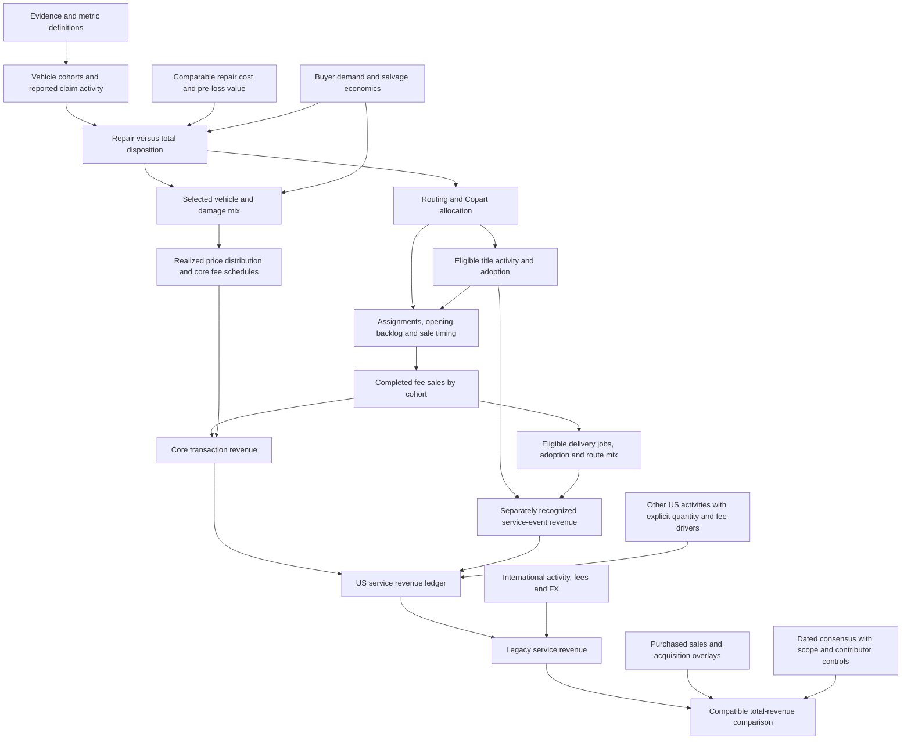

# Copart: architecture required for an evidence-supported difference from consensus

28 September 2026. Current decision document; supersedes earlier statements that the provisional engine's structural closure meant the investment-model architecture was finished. Read alongside the standing research principles. This is an audit and implementation specification, not a forecast revision or investment recommendation.

## 1. Answer and scope

**The model is not finished. The central gap is not a shortage of equations: several relationships needed to test the theses are missing, and several quantities the model treats as known are only calibrated or assumed.** A connected spreadsheet or a zero accounting residual cannot resolve those problems.

The deliverable remains quarterly legacy service revenue, built from units and fee-generating activities. Purchased-vehicle revenue and ACV Auctions are separate comparison overlays. EPS, a new DCF, yard-level CapEx and Excel design are outside this completion task. The focus is the next two fiscal quarters, with four forecast quarters to expose timing reversals and comparison-period effects.

Three different outputs must remain distinct:

1. **Accounting coverage:** every reported service-revenue dollar belongs to one mutually exclusive branch.
2. **Operating explanation:** each forecast branch changes because named quantities, prices, mix or event timing change, with evidence or explicit assumptions.
3. **Investment disagreement:** the resulting total differs from a dated, compatible external forecast for a reason that is not already embedded in that forecast.

We can achieve complete accounting coverage without independently measuring every component. We cannot describe that as 100% empirical reconstruction. Missing evidence must produce an assumption, an explicit range, or an unavailable output—not a disguised growth plug. More granular modeling does not guarantee a larger effect; it can demonstrate that a proposed effect is small or already expected.

### What this audit actually did

Read the standing instructions; traced the current engine, same-quarter historical adapter, input register, completion notes, carrier simplification, selection tests, fee tests, service evidence, historical bridge, consensus review and acquisition reconciliation. Discovery was bounded to existing source families: company disclosures, supplied broker extracts, insurance/CCC evidence, fee schedules, and auction-data feasibility records. No new web collection, scraping, OCR, fitting or paid access was needed to establish these architectural defects.

Ran four small in-memory engine configurations in `../model/integrated_service_2026-09-28/architecture_audit_checks.py`; results and input hashes are in the neighboring JSON. No operating inputs or prior forecast outputs changed. These checks establish how code behaves, not that its economic assumptions are true.

## 2. Findings that change the build plan

| Finding from the current implementation | Why it matters | Required treatment |
|---|---|---|
| One scalar carrier capture rate multiplies every age/body cell; carrier-specific economics are absent | A carrier change can change units but cannot change ASP/RPU through vehicle or contract mix | Keep aggregate capture as a scenario; add a carrier-mix-to-economics interface only when testing that mechanism, with a common-mix fallback explicitly declared |
| Title jobs equal sold units × assumed adoption; delivery uses the same structure | Adoption cannot alter title clearance or sales timing, and independent service events cannot be represented | Separate service-event revenue from the sale-flow schedule; allow a timing effect separately without inventing extra vehicles |
| Repair and pre-loss value can vary by quarter; salvage recovery is hardwired to damage rank | Buyer-demand changes cannot be forecast independently; model assumes a particular relationship between repair severity and recovery | Add distinct expected-net-salvage and realized-auction-price inputs tied by an explicit assumption; preserve joint selection |
| One current buyer schedule and fixed buyer/seller mix apply across periods | The engine cannot distinguish a fee increase, its anniversary, vehicle-price movement and changing buyer categories | Effective-dated fee schedules and separately controlled price distributions, buyer mix and seller terms |
| All forward frequency, repair, value, service adoption, other-US and international multipliers are one | Zero contribution means unchanged settings, not researched economic stability | Populate or explicitly classify each forecast path before interpreting the consensus gap |
| Changing assumed US insurance revenue share from 90% to 80% preserves fitted Q4 US revenue but reduces normalized insurance units by 11.1% | Matching revenue does not identify unit levels or the insurance split | Independent level evidence or explicitly conditional scale; never describe normalized counts as measured vehicles |
| Physical inventory is null and assignment-to-sale timing is bypassed | A six-month forecast can confuse throughput improvement with recurring demand | Add a conservation-based timing interface; estimate lags only if supported |
| Historical dollar anchors hide neither the original reconstruction error nor its causes, but they make displayed history tie automatically | The model has not independently explained history | Preserve the original errors, and validate growth/components separately from the accounting tie |

The carrier and title limitations were confirmed by changing their inputs and observing respectively unchanged RPU and unchanged raw sale units. The alternative insurance-share normalization test confirms level non-identification. The current default arrays and absent inventory are directly recorded by the audit check.

## 3. Minimum complete architecture

Preserve the approved four human-facing views: RPM Summary, Volume Build, Vehicle Economics, and Revenue Bridge. Supporting evidence remains separate. The changes below concern calculation relationships, not more presentation tabs.

Arrows represent causal or accounting dependencies, not claims that their coefficients are known. Other-US title/delivery activity must enter the service ledger too when within scope; it must not be counted again in other-US core revenue.

### A. One metric contract before more inputs

Each consequential observation needs: source and page/cell/line; publication and measurement period; vintage; geography; insurance/noninsurance and owned/consigned perimeter; coverage; numerator/denominator; currency; event stage (claim, valuation, assignment, listing, completed sale or service job); evidence status; and whether it was used to calibrate or independently check the model.

In particular, **all-US fee RPU, US-insurance auction ASP, global units, and insurer premium share cannot be silently multiplied together**. Claim records must also distinguish claims from distinct damaged vehicles; multiple coverages or valuation versions can create multiple records for one vehicle. Use source-defined compatible counts rather than pretending this duplication is known.

### B. Claims and total losses: choose one denominator route

For each supported age/body group, either use surviving fleet × combined reported-claims propensity, or insured vehicle exposure × claims per insured exposure. These are alternatives. Do not multiply a coverage or mileage factor into the existing combined propensity without removing what it already represents.

Total losses = compatible reported claims × conditional total-loss probability. An observed total-claim count already includes its population's exposure change. Cohort reweighting must not add that growth a second time. Keep collision/other non-CAT and CAT treatment explicit; a pooled repair-cost threshold cannot be assumed to explain theft, flood and ordinary collisions equally well. A coarse separate CAT scenario is sufficient initially; a geographic catastrophe model is not required.

The current incremental removal of repairable claims correctly lowers claims and raises TLF while leaving totals unchanged. Retain that identity. It is a possible explanation of a misleading headline, not automatically a revenue-loss driver. Coverage removal, fewer accidents and fewer filed total losses are different mechanisms.

### C. Selection and value: the same vehicles must determine units and fees

Use a simplified economic decision comparison: expected repair-route cost versus settlement-route cost net of expected salvage, with legal/operational exceptions identified. The current repair cost > pre-loss value − net salvage relation is a useful baseline, not a universal decision rule. Rental duration, supplements or processing costs enter only if materially different across alternatives and supported; do not construct an unmeasured claims-cost universe.

For any cohort, the joint distribution of repair scope, pre-loss value and expected salvage determines the selected total-loss population. That selected population then supplies auction prices and expected fees. **A higher value for an auctioned vehicle and a higher chance of reaching auction cannot be estimated independently and multiplied without checking their selection relationship.**

Retain the existing age/body grid initially. Do not add every part or damage direction as another full model dimension. The immediate missing evidence is the response near the totaling boundary, not another precise-looking average repair premium. Calibration to TLF and repaired mean cost does not identify that response. Start with explicit alternative response cases; adopt a point estimate only with independent constraints.

Add two distinct concepts: expected net salvage at the insurer's decision and realized gross auction proceeds later. A common demand change may affect both, with different timing; an unanticipated post-assignment auction-price move affects current proceeds before it can affect future assignment decisions. Seller charges reduce net insurer recovery; buyer fees are not automatically another deduction from insurer proceeds. Bid responses to buyer costs are a separate hypothesis.

### D. Allocation and time: conserve vehicles

Total losses × eligible routing × Copart allocation gives assignments for a consistently defined population. If the evidence only identifies their product, use one effective factor and do not claim separate measurement. Keep the existing Progressive path as a scenario, not default research conviction.

Completed sales in quarter q = opening-backlog sales + sales from each assignment vintage according to its sale-delay distribution. For each vintage, eventual sale probabilities plus withdrawals/other exits cannot exceed one. The inventory check is opening inventory + arrivals − completed sales − other exits = closing inventory, subject to the exact inventory stage definition.

An auction attempt or vanished listing is not necessarily a completed fee sale. Do not count relists as fresh assignments. Distinguish unsold backlog from sold vehicles awaiting pickup before comparing model inventory with company inventory or yard occupancy. Faster title processing can release backlog once and improve future timing; it cannot create the same incremental units permanently every quarter. Where lag evidence is unavailable, keep the sale-equivalent scenario but prohibit a separate timing catalyst claim. Building the interface is required; inventing a detailed lag curve is not.

### E. Revenue: a component ledger rather than a universal per-sale attachment

For a mutually exclusive sales group g:

`Core revenue_g,q = completed fee sales_g,q × E[buyer fee + seller fee | sold cohort mix, contract mix, schedule date]`.

For each service k:

`Incremental revenue_k,q = recognized eligible jobs_k,q × realized net incremental charge_k,q`,

with refunds, displaced/waived charges, bundling, recognition timing and gross/net accounting explicitly handled. The recognized-job population must follow the contract's performance/recognition basis; completion date is not automatically revenue date. “Net incremental charge” means incremental to other ledger rows, not an assumed agent-accounting presentation.

Title jobs are based on eligible assignments/titles, account rollout and within-account adoption. Delivery jobs are based on eligible buyer activity, route mix and adoption. Their sale link is an empirical input, not a universal identity. If contract data are absent, retain scenario components with unresolved levels rather than solving them as a residual and calling that adoption.

US core insurance + US core other + nonduplicated US service events + other identified US service income = US service revenue. Add international services, separately controlling activity, fees and FX. When country detail cannot be supported, a transparent aggregate branch is preferable to synthetic country models. Overall RPU is then an output using the appropriate disclosed unit denominator; it need not be a universal contractual fee per auction.

The historical insurance/core/ancillary allocation is a coupled identification problem. A 90% insurance split and a title/delivery fee assumption together influence inferred absolute units. Replacing one without reconciling the others does not fix the scale.

### F. Expectations and attribution

Keep three separate objects: our operating forecast, dated sell-side estimates, and price-consistent reverse-DCF scenarios. One share price cannot identify a quarterly units/RPU path. CapIQ provides total revenue, not a unique set of operating assumptions.

`Revenue gap_q = our compatible total_q − external compatible total_q`.

`Mechanism contribution_q = model(thesis change, common other assumptions) − model(no thesis change, same other assumptions)`.

These are not the same quantity: consensus may already include the mechanism. Require a named broker premise or explicitly uncertain expectation benchmark before presenting the mechanism as differentiated alpha. Acquisition contribution is a scope adjustment, not organic outperformance.

For two thesis mechanisms, run baseline, A only, B only and A+B. The interaction is R(A+B) − R(A) − R(B) + R(baseline). Report it separately rather than adding isolated sensitivities. Keep carrier and other-branch assumptions common across these comparisons, then challenge the result under alternatives. Preserve correlated repair/value/demand assumptions; don't construct an impossible worst case from unrelated endpoints.

## 4. Work packages, in dependency order

These are completion assignments, not invitations to launch all research at once. Routine bounded work is authorized; expensive collection still requires approval.

| Order and deliverable | Exact first route: access, extraction and transformation | Why this route / alternative | Completion check and stopping rule |
|---|---|---|---|
| **1. Historical and consensus perimeter table** | Reuse `historical_operating_bridge.csv`, reported controls and the saved CapIQ extraction. Inspect targeted sections of supplied broker text/PDF tables for estimate dates, service/purchased split, unit denominator and ACV treatment. Extract text or table coordinates before OCR. Record competing estimates separately. | Highest return before causal refinement: it establishes what dollars and expectations need explaining. Full broker model recreation or inferring driver expectations from a share price is unnecessary. | Every quarter and metric has a population and vintage; services + purchased sales tie where available. Missing contributor detail remains unknown. If local reports cannot resolve CapIQ's perimeter, request a narrow contributor export, not a broad scrape. |
| **2. Base revenue component ledger and identification test** | Map existing historical geography service dollars to proposed insurance core, other core and service-event rows. Search existing disclosures for compatible volume/fee levels and permitted ranges; track each independent constraint. Test which component combinations fit the same totals. | Prevents false precision from simultaneous assumed units, fees and insurance split. An identified relative-growth build is preferable to a fabricated absolute census, but must be labeled as such. | All dollars allocated once, no negative balancing components, units remain unmeasured where only normalized. If multiple decompositions remain possible, retain them and quantify whether they change the thesis conclusion; do not add new fitted coefficients to force uniqueness. |
| **3. Claim and selection contract** | Reuse cohort births, CCC/HLDI definitions, `COUNT_COMPATIBILITY.md` and existing repair/value sources. Align periods/populations; expose fitted versus observed claim mass, CAT convention and marginal-selection response. Implement distinct expected-salvage/realized-price inputs using existing engine primitives. | Directly enables the units/RPU tradeoff while avoiding repeated failed fitting. Comparable repair estimates or aggregate disposition histograms would be more precise than extra auction-only records, but access is unestablished. | Jointly check TLF, selected values and repaired means without reusing all as validation; equal repair/value scaling control; no repeated coverage/count multipliers. Stop on absent pre-decision data; keep alternative selection responses visible. |
| **4. Routing, timing and service-event interfaces** | Map existing assignment/unit/inventory disclosures and local listing feasibility notes. Add vintage flow and event-recognition schemas; carry known historical backlog only if measured, otherwise explicit unknowns and timing cases. Map title/delivery onto eligible populations with bundling controls. | Necessary for quarterly catalysts. A 250-yard simulation would add unsupported detail; national/coarse-vintage flows suffice initially. Existing bad listing data cannot identify sales or lags merely because it is large. | Vehicle conservation, one completed sale count, backlog release not perpetual, no standalone service double counting. Leave timing mechanism inactive if opening inventory/lag evidence cannot support it. Delivery collection remains parked. |
| **5. Core fee and forecast-driver implementation** | Reuse the posted-fee CSV and existing integration method; add schedule effective dates, price-distribution and buyer-category inputs, and seller-fee convention. Use recorded transcript/broker evidence to separate measured price changes from possible mix/adoption. | Exact schedule arithmetic is cheap; another fitted ASP/RPU elasticity would obscure fees and mix. Archived schedule retrieval becomes worthwhile only for a specific missing vintage. | Zero price/schedule changes have zero price-only effect; fee averages integrate distributions; historical schedules not assumed observed; no residual relabeled adoption. Keep service fee/quantity paths explicit if not identified. |
| **6. Complete forecasts, then thesis comparison** | Populate quarter-specific claims, value/repair, fees, services, other-US and international paths from the preceding evidence, with named default cases where necessary. Retain separate purchased/acquisition scope bridges. Run joint thesis comparisons and fixed common carrier cases, then assess alternative scales and other-branch paths. | Prevents every unfinished branch's flat growth being counted as bearish research. Four joint cases usually answer interactions more cheaply and clearly than a large scenario grid or Shapley allocation. | Every consequential delta traces to a dated change and benchmark; no consensus goal-seek; unexplained historical errors remain shown; forecast is not called independently validated without untouched evidence or prospective testing. |

Work packages 2–5 inform one another; notably, fee evidence can help the component ledger and title timing can change the sales mix. Use an explicit revision log rather than silently refitting the starting population after each discovery. Freeze an evidence snapshot before any validation period is evaluated.

## 5. Research options tied to specific model locations

The following are competing hypotheses, not claims of novelty or adopted positions. “Priority” refers to the next discriminating test and feasibility, not confidence in a short.

| Hypothesis and granular mechanism | Competing explanation / counterevidence | Model location and distinguishing test | Priority |
|---|---|---|---|
| **Core fee growth slows despite positive ASP:** a given price gain crosses fewer/less valuable fee thresholds, earlier fee increases lap, and the sold-price/buyer distribution changes | New pricing, different buyers, stronger prices or service fees sustain RPU; aggregate insurance ASP may not describe all fee vehicles | Price distribution × dated schedules × buyer mix; hold sold cohorts fixed for price-only test, then rerun joint selection. Requires a demonstrated difference from the analyst's forecast, not assuming analysts use one-for-one ASP pass-through | High: existing fee evidence; schedule/history/mix gaps explicit |
| **A rising TLF overstates the auction-supply tailwind:** missing minor repair claims shrink the denominator without increasing totals | Accident/coverage/CAT changes or true repair-to-total conversion affect the numerator | Matched count identity before cohort allocation. Existing CCC series do not fully reconcile; cannot adopt a nonfiling coefficient from them. This can invalidate a bullish driver but is not itself a unit decline | High architectural guard; empirical expansion parked without a compatible panel |
| **Vehicle mix improves auction value but reduces claims converting to totals:** crossover/pickup value, repair scope and net salvage jointly determine entry and fees | Higher repair complexity or stronger salvage makes more vehicles total; selection may lower realized recovery | Same age/body claim states through selection and fees. Existing six-month fleet-only effect is small under examined cases; static repair-premium refinement is unlikely to be the best next spend without evidence of a faster change | Retain core composition build; lower priority for extra granularity |
| **Ancillary growth changes as account rollout matures:** title penetration within mature accounts stops rising, but new accounts may still expand; delivery adoption/route mix alters incremental charges | New account wins or service expansion offset maturation; waived fees/pricing and gross/net presentation affect measured revenue | Separate account cohorts, eligible jobs, realized incremental charge and recognition. No measured saturation rate exists; prior public search found no usable product volume/revenue levels | Structurally necessary; targeted evidence only, delivery research remains parked |
| **Salvage demand affects both sides in the same direction:** weaker bids reduce insurer net recovery, making totaling less attractive, while lowering fees on vehicles still sold | Pre-loss vehicle values fall simultaneously and encourage totaling; shifts in damage/seller mix mimic demand weakness | Independent expected salvage and realized price drivers, at fixed damage/vehicle composition, with decision-to-sale delay. Candidate sources: dismantler parts/scrap economics, rebuilders' margins, export destination prices/FX/freight and actual completed bids. None alone identifies the national elasticity | New/high-value interface; first test is evidence feasibility, not a large forecast shock |
| **Title acceleration moves revenue between quarters:** backlog release raises near-term sales and changes age/value mix; subsequent quarters lose the release benefit | Higher assignments sustain sales; inventory decline reflects weaker supply rather than faster clearing | Inventory conservation plus assignment and title/sale dates. Existing aggregate/listing evidence is insufficient for a confident cycle-time coefficient; prior state-level screen was inconclusive/negative, not a clean nationwide timing test | Conditional near-term catalyst; no permanent growth extrapolation |
| **Delivered-cost pressure caps auction bids:** a buyer budgets hammer price + buyer charges + freight; higher freight/fees may crowd out bids, partly offsetting nominal fee gains | Buyers absorb costs, end-market resale values rise, or improved shipping expands demand | Optional buyer-budget response linked to price, then fees; compare route/buyer cohorts only if real observations exist. Avoid applying 100% cost capitalization by assumption | Exploratory, lower priority; outside the current repair-centered framework |

Carrier mix can be an alternative explanation of every observed ASP/RPU movement even when it is not our preferred thesis. If no carrier-specific economics are available, the limitation must widen our attribution range. Do not infer causal carrier pricing from qualitative quotes alone.

### Source breadth with narrow execution

For the next evidence pass, rank by the actual decision observed:

1. **Company and broker operating tables:** revenue scope, fee-unit/RPU trends and forecast premises. Already accessible locally; cheapest first route. A newly noticed JPMorgan September 11 passage estimates FY26 Q4 US service RPU at approximately 5%; this is a broker estimate of reported-quarter economics, not a company disclosure or FY27 forecast. Preserve as a soft cross-check, not a replacement hard control.
2. **Insurer/estimating/repair operations:** claim disposition panels, pre-decision repair estimates, supplements and net-salvage comparisons. Repair shops, estimating platforms, insurer operations, OEM procedures and parts sources observe different pieces. Representative paired claims or a compatible aggregate histogram outrank convenience examples. Prior searches did not locate a usable representative panel.
3. **Auction/buyer/recycler operations:** completed transactions, charges, dismantler margins, export destination economics and freight. These can constrain prices and demand; auction-only samples cannot estimate total-loss incidence. Previously rejected aggregator price fields and stale sale flags must not be recycled as completed-sale evidence.
4. **Title/DMV/processing records:** assignment/title clearance/sale timestamps and service eligibility. Public policy lead times are not measured Copart lag distributions. Do not run another broad title search unless the source supplies a missing timestamp or a credible comparison group.
5. **Fleet/transport/insurance exposure sources:** registration cohorts, sales/survival, mileage and coverage-specific claim denominators. Sales-to-stock and insured-exposure-to-all-fleet transfers remain explicit proxies. More sources repeating CCC do not add independent validation.

No outreach is authorized. A small schema/sample inspection precedes any collection proposal. If a source contains only selected outcomes or incompatible denominators, stop before expanding sample size. The next data request should name the missing fields, population, period and decision—not ask for “more data on Copart.”

## 6. When can a model difference become a pitch point?

Require all five gates:

1. **Economic coherence:** the mechanism changes the right populations and affects both units and fees where appropriate; interactions and timing are conserved.
2. **Evidence beyond calibration:** inputs have identified source support, or the conclusion survives explicitly plausible alternatives. No false confidence interval from analyst-selected ranges.
3. **Expectation disagreement:** a dated forecast premise differs, or the inferred revenue requirement is clearly conditional. Qualitative sell-side enthusiasm is not a quantified driver forecast.
4. **Materiality relative to unresolved assumptions:** the thesis effect must be assessed alongside uncertainty in starting split, service levels, timing and other branches. A large point estimate from an unconstrained derivative does not pass. A model reconstruction miss is a warning, not a statistically estimated error band.
5. **Observable resolution within the horizon:** specify which quarterly disclosure or obtainable operational series will distinguish the explanations. A structural ten-year cohort story needs a near-term exposure change or expectation revision to become a six-month catalyst.

No stock-price percentage follows mechanically from a revenue gap. Margin, persistence, investment and valuation assumptions require a later, separate bridge; the reverse DCF remains conditional. We will not require a preselected short result or force two valid mechanisms to share a sign.

## 7. What to build next, and what not to build

**Next assignment: complete work packages 1–2—the historical/consensus metric table and component-ledger identification—then lock the contracts for claims, sales and service events before expanding the engines.** These establish which portions can be independently forecast and which need explicit bounded assumptions. A historical RPU bridge belongs here only to supply a missing control; it is not a substitute for architecture completion.

Keep the current age/body work, fee integration and provenance. Do not restart them. Do not yet add make/model/trim/part × insurer × yard dimensions, a full repair-shop simulation, 250-yard capacity, granular international countries without data, or an optimization seeking a larger downside. Capacity enters this service-revenue task only if it constrains actual throughput; CapEx/FCF can be a later module.

**Completion standard:** every revenue branch has a population, quantity driver, fee driver, timing convention, historical control and evidence status; every candidate thesis has an explicit entry point and counterfactual; every forecast quarter reconciles; unresolved inputs remain visible and their potential to reverse the thesis is assessed. This can yield a usable model with transparent assumptions. It cannot honestly yield a fully observed absolute bottom-up census if the necessary counts/contracts are unavailable.

## Source map

- Code/state: `../model/integrated_service_2026-09-28/{engine.py,history_repair.py,assumptions.json,INPUT_REGISTER.md,CONNECTED_ARCHITECTURE.md}`.
- Historical controls and population limits: `legacy_foundation_2026-09-28/HISTORICAL_BRIDGE.md`; `claims_discovery_2026-09-28/COUNT_COMPATIBILITY.md`.
- Selection evidence: `../model/integrated_service_2026-09-28/{THRESHOLD_VALIDATION.md,MATERIALITY_SCREEN.md,CLAIMS_FILTER_AUDIT.md,INCREMENTAL_NONFILING.md}`.
- Carrier source and calibration limitations: `carrier_test_2026-09-28/README.md`.
- Fees/services and failed disclosure searches: `auction_price_test_2026-09-28/README.md`; `rpu_service_build_2026-09-28/{README.md,DELIVERY_DISCLOSURE_SEARCH.md,DELIVERY_EVIDENCE_UPDATE.md}`.
- Expectations: `consensus_review_2026-09-28/{README.md,PROVISIONAL_COMPARISON.md}`; `acv_reconciliation_2026-09-28/README.md`.
- Broker cross-check: local September 11 JPMorgan report ending `124345098.txt`, lines 37–59 in `/Users/kwu/Documents/ChatGPT/HFAC x Citadel/research/cprt_discovery_plan_2026-09-26/sources/`. Report excludes ACV; current-quarter RPU is an analyst estimate. Licensed text is not copied into this audit.
- Data dead ends: `archive/HANDOFF_2026-09-11_updated-to-09-25.md`, section 5; prior research direction and method: `research_execution_2026-09-26/research_execution_plan_v2.md`.
