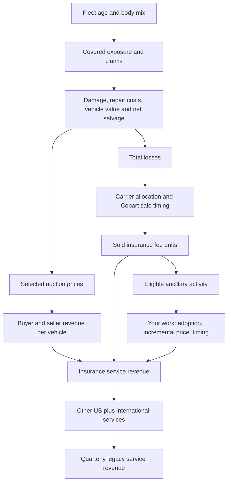

# Teammate assignment: identify Copart's ancillary-service contribution to RPU

**Research snapshot: September 28, 2026. Owner: incoming teammate.**

Your assignment is to establish what we can defensibly model about Title Express and related title services: their eligible activity, adoption, incremental fees and revenue timing. Delivery is secondary and bounded. We own the fleet, damage-selection, carrier and integrated revenue engines. Your work should supply evidence and clearly labeled proposed inputs to those engines, not create a competing company model.

**A successful outcome can be bullish, bearish or inconclusive. You are not being asked to prove saturation.** We need a usable measurement of the service contribution—or a precise explanation of which variable cannot be identified and what observation would resolve it.

## 1. Pitch context: why this assignment matters

Our pitch asks whether changes in revenue per sold vehicle compensate for changes in the number of vehicles Copart sells. Higher vehicle values can improve auction proceeds while making repair more economical, reducing auction supply. Higher repair costs or stronger salvage recovery can push the other way. Separately, selling more services around a vehicle can increase RPU without generating more auction vehicles.

The intended model jointly follows the same vehicle cohorts through the insurance total-loss decision and auction fees. We then add incremental ancillary services without counting them twice. The two central research directions are:

1. **Fleet age/body mix and damage selection:** how many vehicles become total losses, and what are the values and fees of the selected vehicles? We own this.
2. **Service adoption:** how much revenue is earned around those vehicles, and is that incremental lift accelerating, continuing or fading? You own the evidence and input proposal for this.

The possible short is that richer auctions and more ancillary services fail to offset weaker supply, relative to expectations. A long is possible if those offsets are stronger. Neither direction is established merely by observing RPU growth. Our horizon is approximately six months, expressed in fiscal-quarter forecasts.

For compatible populations, `service revenue = fee units × RPU`. Growth is `(1 + unit growth) × (1 + RPU growth) − 1`. ASP is the auction price, not Copart's RPU. Claims × total-loss frequency produces industry total losses, not automatically Copart sales. Your product evidence must preserve these distinctions.

## 2. Architecture and current state



This is the intended economic flow, not a claim that every variable is measured. The current model uses normalized sale-equivalent activity, not an observed physical inventory ledger. Its working forecast applies modeled driver ratios to the matching reported quarter a year earlier. Original historical reconstruction errors remain unresolved and visible. Do not use an unexplained historical residual as your estimate of ancillary revenue.

Scope is **legacy service revenue**, excluding purchased-vehicle sales. ACV Auctions is a separate acquisition overlay, not part of your assignment. US insurance is our detailed branch; other-US and international services remain separate. The assumed insurance share is 90% of US service revenue, not a disclosed insurance unit share.

Historical US fee RPU growth is +7.5% in FY26Q1, approximately +3.73% in Q2 and +3.05% in Q3. Q1 is company-disclosed; Q2/Q3 are derived from reported revenue and previously checked broker fee-unit growth. These are aggregate results, **not measurements of title-service contribution**. They cannot independently identify adoption, pricing or saturation.

## 3. Exactly what we want answered

### Primary: title services

Answer these questions in order, recording evidence and unresolved items separately:

1. **Product boundary:** What is Title Express? Which title-related tasks are included? Are similarly named services the same product, separate products or geographic variants?
2. **Customer and payment:** Who purchases or pays for the service—insurer, another consignor or buyer? Is payment separate, bundled, waived or contingent on a later event?
3. **Eligibility:** Which assignments or vehicles can use it? Are jobs restricted to vehicles ultimately sold by Copart? Can Copart process titles for vehicles auctioned elsewhere or never sold?
4. **Adoption:** Is the available statistic participating insurers, locations, assignments, titles processed or sold vehicles? What is its denominator? A count of insurer customers is not volume-weighted penetration.
5. **Economics:** What incremental revenue does Copart recognize per completed job? Distinguish list price, realized fee, billing, revenue and margin. Record rebates, bundled fees and waivers if known.
6. **Timing:** What triggers the job and revenue recognition? Identify any evidence of a lag between assignment, title work and sale. Do not infer accounting timing solely from operational sequence.
7. **Trajectory:** Which observations establish adoption levels or changes over time? Does job growth come from more eligible activity, increased penetration or both?
8. **Forecast implication:** What supports continued adoption, deceleration or acceleration over FY27Q1–Q4? Is there a specific anniversary or rollout that could affect the next two earnings comparisons?

### Secondary: delivery, only where evidence is accessible

Determine whether a new disclosure identifies Copart-recognized revenue, job counts, adoption or gross/net treatment. The July 23, 2025 Super Dispatch announcement establishes an offering and integration, not Copart's take rate, adoption or revenue. Shipping quotes are not automatically recognized Copart revenue. Do not repeat an open-ended search for unavailable delivery economics.

Other ancillary products may be logged as leads. Do not expand into a broad product census unless there is clear evidence of material revenue and a distinct model implication.

## 4. The exact model interface

We need **levels and definitions first**, then growth. All fractions use decimals: 0.25 means 25%. Prices are USD per specified completed job; revenue outputs are USD millions. Counts must identify whether they are jobs, titles, vehicles, assignments or customers.

The general service equation we want to support is:

`recognized revenue in quarter t = sum over origin quarters s of (eligible activity[s] × adoption[s] × jobs per adopted activity[s] × incremental revenue per job[s] × recognition share[s,t])`.

For this equation, adoption refers to the fraction of eligible activities using the service. Jobs-per-adopted-activity defaults to one only when justified. Recognition shares describe when that cohort's revenue is recognized. If the source measures completed jobs directly, do not also multiply by a completion rate. If cancellations or unbilled work matter, document their treatment explicitly rather than burying them in adoption.

This full timing interface is **not yet implemented**. A proposed timing distribution needs evidence, or an explicitly labeled scenario. An unsupported lag is not better than an explicit same-quarter assumption.

### Current inputs you are replacing or challenging

File: `model/integrated_service_2026-09-28/assumptions.json`.

| Existing field | Current value | Current interpretation | Evidence needed |
|---|---:|---|---|
| `title.adoption` | 0.50 | Effective title jobs per modeled insurance sold unit at the base; treated as adoption under a one-job/full-eligibility assumption | Job count with compatible denominator, or eligibility and adoption separately |
| `title.net_incremental_fee` | $50 | Incremental recognized revenue per job after avoiding bundled overlap; not profit | Realized fee or clearly bounded estimate and billing/accounting definition |
| `title.included_in_seller_fee` | false | Title added separately to seller revenue | Evidence of bundling; current switch suppresses the entire separate title addition when true |
| `quarter_drivers.title_adoption_multiplier` | Eight 1.0 values | Each quarter's effective adoption divided by the base adoption | Quarterly levels from which we compute the multipliers |
| `delivery.adoption` | 0.10 | Jobs per modeled insurance sold unit under the same simplifying convention | Compatible shipment and vehicle populations |
| `delivery.gross_external_revenue_per_job` | $300 | Assumed gross revenue; gross accounting not verified | Actual recognized revenue basis, not customer transport spend alone |
| `delivery.fee_waiver_per_job` | $0 | Explicit offset to delivery contribution | Whether offsets exist and which fees they reduce |
| `quarter_drivers.delivery_adoption_multiplier` | Eight 1.0 values | Quarter effective adoption divided by base adoption | Quarterly levels with compatible denominator |

**Every number above is an existing placeholder, not a research finding. Do not search for confirmation of those numbers.**

The current engine computes title revenue as sold units × adoption × quarter multiplier × incremental fee. Delivery uses the analogous expression less its waiver. It has no separate eligibility fraction, quarterly product-price array, partial-bundling fraction or product-specific recognition ledger. Mark evidence requiring those features as `adapter_required`; we will revise the engine. Never force a fee change into the adoption multiplier just because that array already exists.

A clean same-quarter mapping is possible only if product population and timing match the insurance sold-unit branch. Then effective adoption equals `eligible fraction of sold units × adoption among eligible units × jobs per adopted unit`. Under the current one-job design this must fall between zero and one. Ratios above one may be real for another population or multiple jobs, but require an adapter; do not clip them.

**Important base treatment:** the forecast uses each modeled FY27 RPU divided by its matching FY26 RPU. A constant ancillary amount in both periods does not by itself create recurring RPU growth. Supply historical and forecast levels together. We will rerun normalization when base assumptions change; you should not compensate by changing claims, carrier capture or the insurance revenue share.

## 5. Period and population rules

- Target historical quarters: FY26Q1–Q4. Target forecast quarters: FY27Q1–Q4. Earlier FY25 observations are useful for rollout comparisons; retain them at their actual frequency.
- Copart fiscal Q1 ends October 31, Q2 January 31, Q3 April 30, Q4 July 31. FY27Q1 spans August–October 2026. Label rows as `FY2027Q1`, etc.
- Preserve calendar-year, year-to-date, trailing-period and point-in-time source labels. Do not divide annual jobs by four or convert a point-in-time penetration level into a quarterly average without a stated method and assumption.
- Record source publication date and metric period separately. Only use evidence available by the declared research cutoff for an as-of forecast. Record later evidence separately if the project advances.
- Geography must be explicit: US, international, global or unknown. Customer scope must distinguish insurance, noninsurance or mixed. Global/mixed observations cannot be inserted directly into the US insurance branch.
- A service on vehicles not sold by Copart needs its own activity denominator. Do not divide it by Copart sold units and call the result penetration.
- Preserve as-reported versus constant-currency and organic versus acquired definitions where relevant. Unknown scope stays unknown.

## 6. End-to-end research workflow and stopping rules

**Pass 1: existing evidence.** Read the short source map at the end, then inspect existing transcripts and supplied broker research. Search targeted terms such as “Title Express,” “title processing,” “title procurement,” “services per unit,” “revenue per unit,” “penetration,” “adoption” and “ancillary.” Read surrounding text to recover denominator and period. This avoids spending time reacquiring sources already held by the team.

**Pass 2: targeted gaps.** Use AlphaSense for a specific missing quantity or definition. Prefer company filings/transcripts and direct product terms for business/accounting definitions; use broker reports for estimates and interpretations, clearly labeled. Expert interviews may provide leads or bounded judgments but are not equivalent to audited disclosure. Multiple reports repeating the same management quote count as one underlying observation.

**Pass 3: reconcile.** Build the disclosure timeline before estimating numbers. Investigate apparent conflicts in denominator, geography, period or product definition. Retain both conflicting claims and explain which, if either, is suitable for the model.

**Pass 4: map.** Translate usable observations into the standard inputs below. For derived values, write the exact arithmetic and identify every evidence ID and assumption. For proposed forecasts, state the mechanism and the observation that could disprove it. If only a qualitative conclusion is supported, deliver that; do not manufacture a numerical adoption curve.

**Pass 5: handoff.** Provide a compact result and the structured tables. We will review compatibility and integrate centrally. You do not need to create an Excel workbook, run the fleet engine or produce a valuation.

Suggested first checkpoint: after roughly two hours of targeted work, report whether you found usable numerical disclosure, only qualitative evidence, or a population mismatch. This is a research-efficiency checkpoint, not an instruction to stop despite a promising inexpensive lead. Before paid acquisition, bulk scraping, large OCR batches or extensive agent-driven searches, bring the proposed method, cost, expected information gain and cheaper alternatives back to the project owner. No contacting companies, insurers, brokers or experts without separate authorization.

If two focused source passes fail to identify a variable, record the search gap and the cheapest next discriminating source. “Not found in these sources” is not proof that the data do not exist. Do not spend the entire assignment trying to identify a private price term.

## 7. Exact deliverables

Deliver a folder named `docs/service_adoption_handoff/` containing the following. CSV files should be UTF-8 with headers. Empty numeric cells mean unknown; never use zero for missing. Use semicolons inside ID lists. No new full licensed reports need to be copied into Git.

### A. `README.md`: decision note, approximately 2–3 pages

Include: product/payment map; dated evidence summary; what can and cannot be quantified; proposed input changes; long/short implications; competing explanations; next-quarter test; and any required engine changes. Explicitly answer: **Does the evidence support adoption deceleration, continued growth, acceleration, or no conclusion?** Separate facts from your interpretation.

### B. `evidence.csv`: one row per consequential observation

Required columns:

```text
evidence_id,product,source_type,source_title,publication_date,source_url_or_local_path,page_or_section,metric_period_start,metric_period_end,period_basis,geography,customer_scope,metric_name,value,unit,numerator_definition,denominator_definition,short_quote_or_paraphrase,evidence_status,limitations,underlying_source_id
```

Use stable IDs such as `TE001`. `source_type` should distinguish company filing, company transcript, company product material, broker estimate, expert interview and other. `evidence_status` must distinguish `direct_disclosure`, `third_party_estimate`, `derived`, `proxy` or `qualitative`. Prefer a short excerpt or faithful paraphrase plus an exact locator. Keep the original source unit; put conversions in the derivation table. `underlying_source_id` identifies duplicated underlying claims.

### C. `quarterly_inputs.csv`: one row per product × quarter × proposed parameter

Required columns:

```text
input_id,product,period,parameter,value,unit,population_id,status,evidence_ids,derivation_id,model_target,integration_status,reason
```

Allowed `status`: `observed`, `derived`, `proxy`, `assumed`, `unknown`. Allowed `integration_status`: `direct_mapping_candidate`, `adapter_required`, `not_identified`. Mapping candidates still require our integration review.

Standard parameter names:

- `eligible_fraction`: eligible activities divided by the stated base population.
- `adoption_fraction`: participating activities divided by eligible activities.
- `jobs_per_adopted_activity`: completed/billable jobs per adopted activity, with exact stage definition.
- `effective_jobs_per_insurance_sale`: only when numerator, sale denominator and timing genuinely match.
- `recognized_revenue_per_job_usd`: Copart revenue per job before separately listed model offsets; specify gross/net and bundling in population definitions.
- `incremental_revenue_per_job_usd`: addition not already embedded in modeled seller or other fees; state the bridge from recognized revenue.
- `fee_waiver_per_job_usd`: a positive deduction, not a negative revenue addition.
- `recognized_product_revenue_musd`: direct product revenue control if available; not an extra revenue line to add on top of the job calculation.

Provide rows for the eight target quarters for the parameters your evidence bears on. Use blank values with `unknown` for genuinely unavailable quarters; do not fill forward silently. Additional parameters are allowed if defined and marked `adapter_required` where necessary.

### D. `definitions_and_derivations.md`: the audit trail

Define each `population_id`: geography, payer/customer, vehicle ownership/insurance status, job stage, eligibility, denominator, accounting basis, product boundary and timing. Define each `derivation_id` with the formula, evidence IDs, assumptions, units and rounding. A future reviewer should reproduce your number without interpreting prose or rediscovering a source.

Also record proposed adapter changes. For example: “title jobs are measured at assignment, not sale; need assignment cohorts and a recognition mapping before insertion.” If offering an assumed scenario, label it as such and explain why it is a useful bounded case rather than an estimate. Do not add elaborate sensitivity cases merely to fill gaps.

### E. Optional `recognition.csv`, only if timing evidence is available

```text
product,origin_period,recognition_period,revenue_recognition_fraction,status,evidence_ids,derivation_id
```

Fractions apply to the origin cohort's ultimate recognized revenue and must be nonnegative. If the table includes the full recognition horizon, each origin cohort sums to one. If the forecast window truncates that horizon, state the remaining share explicitly in the definitions; do not renormalize it into earlier quarters. Partial recognition schedules cannot be integrated until the missing horizon is accounted for.

## 8. Worked integration example — fabricated, not evidence

Suppose a source actually established that 80% of our insurance sales are eligible, 40% of eligible sales use the service, one job is completed per adopter, and each job adds $50 of recognized revenue in the sale quarter without fee overlap.

Then effective jobs per sale = `0.80 × 0.40 × 1 = 0.32`, and incremental RPU = `0.32 × $50 = $16`. Under the current schema, a base adoption of 0.32 and fee of $50 could represent this **only after population and timing checks**. If next year's adoption among eligible sales rose to 45%, with other inputs unchanged, effective jobs per sale would be 0.36 and the adoption multiplier relative to the base would be `0.36 / 0.32 = 1.125`. Incremental RPU would rise by $2, from $16 to $18.

If the same source instead counted title jobs for all insurer assignments, including vehicles sold elsewhere, none of that arithmetic would establish jobs per Copart sale. That result requires a separate population adapter. If the $50 is already included in modeled seller fees, adding $16 would double count revenue. If it is a customer shipping payment mostly passed to carriers, it does not establish $50 of recognized revenue. These checks are part of your deliverable, not optional caveats.

## 9. Acceptance criteria before integration

- Every proposed nonblank number has a definition, evidence IDs or an explicit assumption, and reproducible arithmetic where derived.
- Fractions are on the correct denominator and within their legitimate bounds. No insurer-customer counts are passed off as vehicle adoption.
- Each historical/forecast period is labeled; annual and point-in-time observations retain their actual basis.
- Dollar amounts distinguish recognized revenue, billings and profit; incremental fees exclude amounts already in another model line.
- Mixed/geographic populations are not silently allocated to US insurance.
- Level changes, growth rates and growth contribution are separate. Job growth is not automatically penetration growth.
- Missing data remain missing. A proposed guess is labeled `assumed`, not `derived` simply because a formula contains it.
- Conflicting sources and contrary evidence are retained. The note identifies at least one credible competing explanation for the favored interpretation.
- Current engine limitations are respected; unimplemented timing, partial bundling or price paths are flagged instead of hidden in adoption.
- No core model files are edited. Submit the handoff folder or a separate branch; we own integration and normalization. Do not overwrite concurrent research or raw data files.

## 10. Starting source map

Read these first, in order:

1. [Memo writer handoff](MEMO_WRITER_HANDOFF_2026-09-28.md): pitch, competing mechanisms and intended memo.
2. [Historical repair](../model/integrated_service_2026-09-28/HISTORY_REPAIR.md): current forecast convention and unresolved validation.
3. [Model input register](../model/integrated_service_2026-09-28/INPUT_REGISTER.md) and [current assumptions](../model/integrated_service_2026-09-28/assumptions.json): existing placeholders and product scope. The historical-repair note supersedes older seasonal/base descriptions.
4. [Integrated engine](../model/integrated_service_2026-09-28/engine.py) and [same-quarter adapter](../model/integrated_service_2026-09-28/history_repair.py): optional technical reference for exact interfaces.
5. [Broader research handoff](MODEL_AND_RESEARCH_HANDOFF_2026-09-27.md): previous research and source limitations. Earlier forecasts are not current adopted conclusions.

Saved transcripts are under `raw/transcripts/`; accessible licensed research may remain local rather than included in Git. Ask the project owner for a specific missing report rather than assuming an inaccessible path means no report exists. AlphaSense is available through the owner for targeted follow-up; CapIQ is more relevant to the separate expectations benchmark.

**The final handoff should let us answer:** how many relevant jobs occur, how much incremental revenue Copart recognizes from them, in which quarter, and with what evidence—without you needing to rebuild the fleet model or us needing to reinterpret your denominators.
