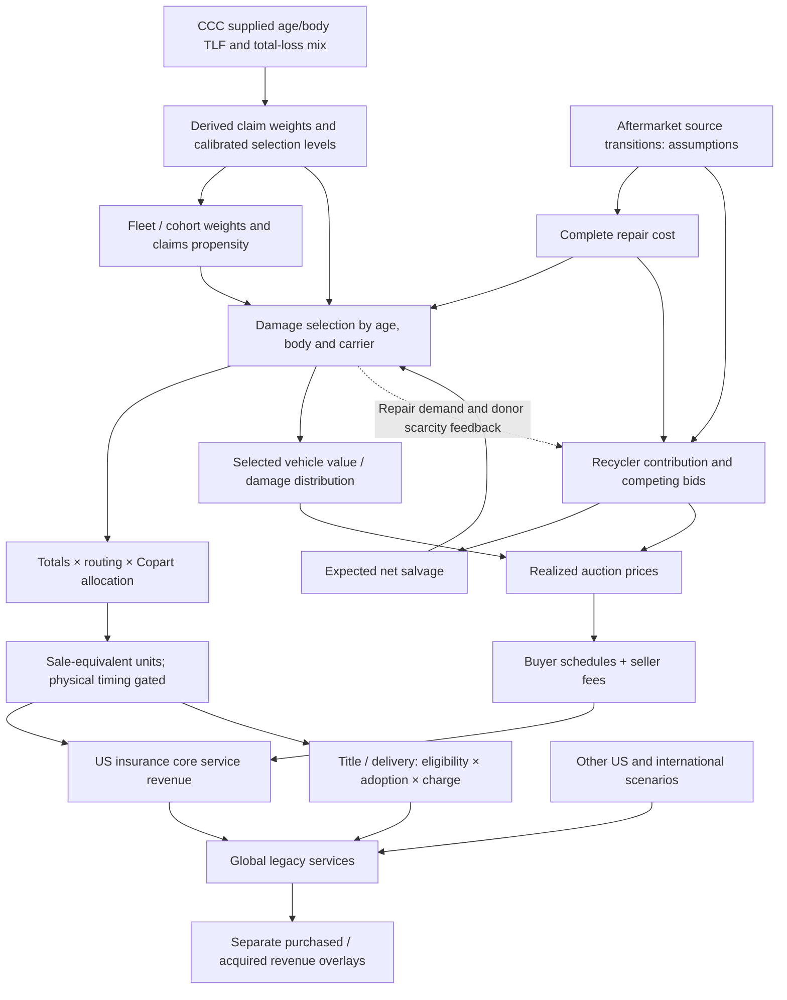

# Fable handoff: Copart revenue model

29 September 2026. **Build an editable revenue scenario workbook. Do not present the illustrated downside as an independently validated forecast.** Audit details and unresolved inputs are in `AUDIT.md`.

**30 September publication update:** Read `docs/pitch_audit_2026-09-29/README.md` and `RESEARCH_STATE.md` first. The agreed pitch status is intellectually interesting structural research without an established measurable forecast error tied to an observable near-term catalyst. The refreshed ZIP includes the subsequent parameter, Bidmate, catalyst and pitch notes. The full-year 5.5-point scenario remains a stress, not an implemented three-year national adoption path; $91m is a delta versus our reference, not a measured consensus miss. The two competition theses still require one dated combined forecast. The original full reproduction and refreshed-package integrity checks are identified separately in `portable_check.json`.

Follow-up evidence is in `docs/aftermarket_transition_evidence_2026-09-29/README.md`: 35 historical component-price observations, current supplier/insurer/catalogue constraints, rounding bounds from the existing CCC counts, a descriptive-fit diagnostic and separate historical-price-proxy sensitivities. Include these as evidence/sensitivity views; they do not replace the default inputs. Its question 2–5 roadmap explains how to close the remaining audit gaps.

## Authoritative implementation and scope

- **New supplied CCC data:** use `model/ccc_age_body_2026-09-29/README.md`, `reference_config.json`, `cohort_anchor.json`, `aftermarket_inputs.json` and that directory's outputs for the CCC-based scenario family. Reference FY27 services $4,093.08m; larger sourcing case $4,002.41m. Keep the prior family as a comparison. Do not mix the two baselines or present the old repair/value target fit as retained in the new case. Source geography/coverage and Utility/Van mappings remain provisional.
- Main revenue engine: `model/revenue_architecture_2026-09-28/model.py` and its saved `scenario_configs.json`.
- Aftermarket adapter: `model/aftermarket_bridge_2026-09-29/bridge.py` and `inputs.json`.
- Imported helper library: `model/integrated_service_2026-09-28/engine.py`. It supplies loading, fleet transformation and fee helpers. **Do not run its old `main()` as a competing forecast or combine old forecast outputs with the successor.**
- Financial/fleet/fee/carrier snapshot: `model/linked_service_revenue_2026-09-28/inputs.json`.
- Saved calibration: `docs/fleet_selection_2026-09-28/age_constrained_engine_results.json`; source/interpretation in `AGE_CONSTRAINED_ENGINE.md`.
- Body births: `docs/historical_body_births_2026-09-28/candidate_body_births.csv`.
- Inherited fleet convention: `model/integrated_service_2026-09-28/assumptions.json`; current configuration comes from the successor, not the old model's other default forecast settings.

Principal output is quarterly **legacy service revenue**, split into insurance core, title, delivery, other US and international. Purchased-vehicle revenue is a separate comparison overlay. Acquired service/total revenue remains missing unless explicitly supplied and classified. Earnings, cash flow and valuation will be built later by the user.

## Architecture



There is no standalone measured accident census behind the relative claims index. The prior-year insurance unit level is inferred from allocated service dollars divided by assumed all-in RPU. Keep those counts labeled modeled, not disclosed.

## Four workbook reading views

| View | Required content | Main source |
|---|---|---|
| RPM Summary | Quarter/year service totals, units/RPU deltas versus reference, scenarios, named dated benchmark, evidence status | Both scenario-summary and quarterly-output files |
| Volume Build | Cohort population/relative claims, TLF, routing/capture, inferred unit base, forecast sale-equivalent units, timing option | Current engine and saved calibrated/fleet inputs |
| Vehicle Economics | Eligible sourcing basket, repair/value distribution, expected versus realized recovery, selected ASP, buyer fee bands, seller fees, title/delivery assumptions | Aftermarket inputs; calibrated cohorts; fee grid; current scenario configuration |
| Revenue Bridge | Insurance core + title + delivery + other US + international; separate purchased/acquired fields; unit/RPU/product interaction | `quarterly_results.csv`, `quarterly_scenarios.csv`, `base_component_ledger.csv` |

Supporting tabs should separate sources, assumptions, calibration and checks. Use clear statuses: observed, derived, proxy, calibrated, assumed, unknown. Avoid a single apparent “Base” case until its forward assumptions are selected. Compare each scenario with its own compatible reference. Do not label the most negative case the forecast.

## Equations to preserve

1. **Repair basket:** cost is the sum of physical source share × comparable price. Complete-bill change equals the eligible basket's initial bill share × the basket's relative cost change. Keep OEM displacement and recycled displacement separate.
2. **Selection:** within each age/body/carrier cell, compare latent repair cost with pre-loss value less expected net salvage. For the original family, use the saved six medians, six cohort values and two fitted dispersions. For the CCC family, also apply the supplied age/body repair-level multipliers and claim weights before selection; do not refit to revenue or the desired downside. Value/body ratios and recovery rank are assumptions.
3. **Price feedback:** recycler contribution change, competing rebuilder economics and donor scarcity imply a price shock. Match that shock to the selection-induced change in repairs/totals. The bridge currently solves one equal-quarter-average annual shock by bisection. These coefficients are scenarios, not estimated elasticities.
4. **Fees:** apply posted stepwise fees to the selected price distribution, including buyer mix, virtual/fixed fees and seller terms. Do not use a single constant fee/ASP elasticity. The current integration uses 1,024 points per selected cell.
5. **Revenue:** preserve exclusive component accounting. In the main scenario, attached title/delivery charges average an assumed $55 per sale; changes in units affect these dollars. General service-event schedules exist in the core engine and should retain their separate eligibility/recognition conventions.
6. **Reference versus growth:** the thesis price shock compounds on the reference's +3.7% price continuation. A negative contribution versus reference need not mean falling YoY ASP or RPU. Do not replay the 2024–25 observed sourcing change as new FY27 adoption.
7. **Timing:** default is sale-equivalent. The incremental-delay sensitivity conserves deferred units, but is not a measured physical inventory model. Leave physical timing gated until opening balances and vintage fees are provided.
8. **Benchmarks:** use September 11 JPM $4,061m FY27 service revenue only as a dated ex-ACV comparison. Keep CapIQ total revenue's acquisition/service scope unresolved. The materiality hurdle is a reverse-solved requirement, not fitted evidence.

## Reproduction and acceptance

Run from the extracted package root using Python 3.9 or newer; standard library only:

```text
python3 model/revenue_architecture_2026-09-28/test_model.py
python3 model/revenue_architecture_2026-09-28/run.py --reuse-saved-evidence
python3 model/aftermarket_bridge_2026-09-29/bridge.py
python3 model/aftermarket_bridge_2026-09-29/test_bridge.py
python3 model/ccc_age_body_2026-09-29/integrate.py
```

`REPRODUCE.py` runs these five steps and checks the reference and larger-shift annual values. The explicit snapshot flag avoids the licensed report path. Source refresh is a separate operation; it has not occurred merely because these commands pass.

At unchanged inputs, Excel should reproduce the original family below. For the CCC family, use $4,093.077730m reference service revenue, $4,002.414466m larger-shift revenue and −$90.663264m versus its own reference; retain its separate calibration and cross-checks. Do not mix the two families.

Original-family controls:

| Control | Target |
|---|---:|
| FY26 observed global service revenue | $3,969.520m |
| FY27 reference legacy service revenue | $4,105.804039m |
| Larger-shift FY27 legacy service revenue | $4,015.148173m |
| Larger-shift change versus reference | −$90.655866m |
| Larger-shift US insurance units versus reference | −2.057044% |
| Larger-shift insurance all-in RPU versus reference | −0.889577% |
| Larger-shift units / RPU / interaction contributions | −$63.682573m / −$27.539800m / +$0.566506m |

Use a $0.1m consolidated-service reconciliation tolerance for the Excel numerical implementation, and explain any larger difference rather than adjusting a plug. This is a spreadsheet acceptance tolerance, not an economic confidence interval. Retain zero-shock, constant-composition, no-switching, fee-band and inventory/service conservation checks. Validate the fee calculation before trusting small RPU deltas.

## Package contents and limits

The curated ZIP includes current engines, saved inputs, calibration, output tables, source-status notes, testing fixtures, this handoff and audit results. `FILE_MANIFEST.json` fingerprints every packaged file. A relocated reproduction test is recorded in `portable_check.json` beside the ZIP in the repository.

Raw licensed transcripts, sell-side reports, private workbook attachments, unrelated scraper data and abandoned models are excluded. Extracted numeric facts and provenance remain. The underlying public financial releases and source chart images were inspected during the audit; the source-audit script requires the original local/raw sources and Git baseline, and is not a portable source revalidation command.

Fable may proceed with layout and formula translation while evidence gaps remain visible. The decision to adopt a revenue forecast requires the outstanding sourcing, switching, applicability, baseline and perimeter work in `AUDIT.md`.

## 1 October successor audit and combined scenarios

Read `docs/thesis_architecture_audit_2026-10-01/README.md` and `model/thesis_audit_2026-10-01/README.md` before extending the workbook. The new package integrates premium scenarios, explicit carrier paths/dated terms, fleet isolation and a quarterly sourcing ramp. It contains two clearly labeled comparisons and exact contribution attribution. The saved CCC reference remains $4,093.077730m; the new illustrative combined case is $3,904.623888m, with −$132.820456m allocation and −$55.633386m aftermarket contributions versus that reference. Premium non-recovery and fleet roll are already in the reference: do not add their diagnostic-comparator effects again. The earlier ZIP remains a dated snapshot and does not contain these additions. No workbook was edited by this audit.
